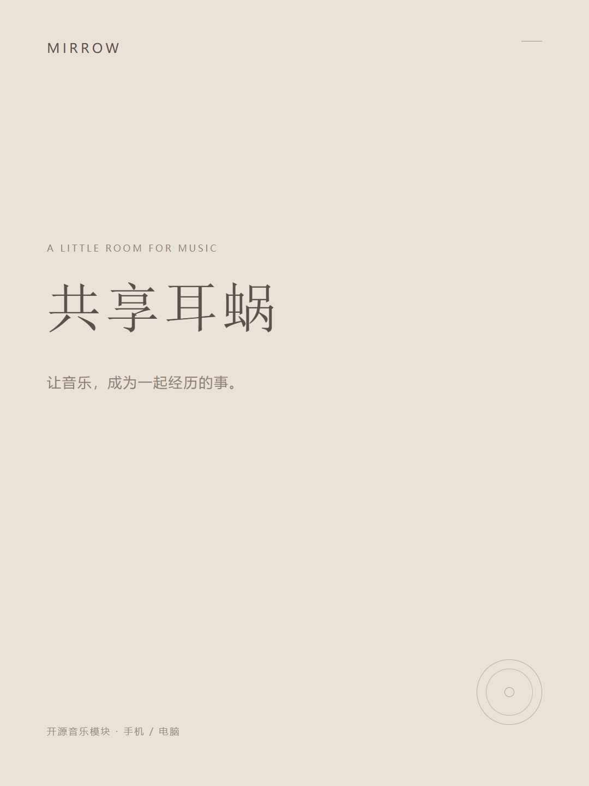

# MIRROW · 共享耳蜗

让 AI 与你共享一段真实的听歌经历：歌曲卡片、一起听、歌单、歌词与音频材料、播放回执、音乐事件和条件性日整理。

这是 MIRROW **完整的现役音乐模块**：后端、原版音乐 React UI、Windows 网易云控制、Android 原生 MediaSession／曲尾保护，以及可运行的轻量宿主。整机的私有人格、自我书、聊天记录和记忆数据库不随包分发。示例宿主没有 AI 大脑；模型通过公开工具与上下文接口接入。

本模块在 MIRROW 仓库的 `music-cochlea/` 目录独立发布。以下命令以这个目录为起点；克隆整仓库后先执行 `cd music-cochlea`。单独下载模块 ZIP 时，直接进入解压目录。



## 功能

- 歌曲／歌单卡片：链接识别、人工纠错、输入框附件、异步制卡、消息删除和重复分享计数。
- 按发起设备控制真实网易云 App；回执未确认不算播放，失败不自动换设备。
- 单曲停止、顺序播放、列表循环、单曲循环；持续一起听、安静陪听。
- 多选同步歌单；个人／AI／共有归属；新建、改名、删除、加减曲目与漫想默认收藏处。
- 共享歌库、歌词与节拍／调性／能量曲线缓存；后台材料准备有界重试。
- 主聊天工具、自主活动候选目录和幂等歌单行动；保留选择来源、操作理由和真实回执。
- 已确认的歌单事件与音乐体验记录；真实活动才参与日整理，感想与设备观察分开。

## 目录

```text
backend/music_system/        播放事实、REST、SQLite、歌单、材料、卡片和日整理
backend/music_cochlea/       身份、缓存、识别和可选旋律分析
backend/behavior_scheduler/  公开工具结果／请求来源合同及音乐工具
backend/mirrow_core/         公开共享状态与设置适配器
backend/host_ports.py        记忆、认知、事件与设备的宿主协议
backend/local_host.py        示例消息、音乐体验与事件 SQLite
backend/music_mcp/           可选独立 MCP，不是共听回退
frontend/src/music/          原版音乐组件与样式
frontend/src/shared/         卡片类型、API 地址和认证适配
android/                    音乐专用宿主、Relay 和网易云原生控制
docs/                       接口、归属和发布审计
media/                      封面及虚构资料 demo
```

## 界面演示

Node.js 22.12+ 或 24+：

```sh
cd frontend
npm ci
npm run dev
```

打开 `http://127.0.0.1:5173/?demo=1`；播放页 `?demo=1&view=player`，歌单页 `?demo=1&view=playlists`。demo 的歌曲、歌词、感想与播放状态全为虚构，所有请求在前端拦截，不连接真实网易云。音乐组件与样式沿用现役模块，外层聊天壳是独立接入示例。

分享图片：[极简封面](media/xhs-cover.png)、[手机音乐中枢](media/demo-mobile-player.png)、[聊天歌曲卡片](media/demo-mobile-chat.png)。原图分别为 1080×1440 和 1170×2532。Windows 安装 Edge 与 `pip install playwright` 后，可将开发服务启动到 5187 端口，再在根目录运行 `python scripts/render_media.py` 重现图片及虚构卡片发送／删除验收。

## 真实后端

Python 3.11+，从仓库目录执行：

```sh
cd backend
python -m venv .venv
# Windows: .venv\Scripts\activate
# macOS/Linux: source .venv/bin/activate
python -m pip install -r requirements.txt
python -m uvicorn app:app --host 127.0.0.1 --port 8005
```

普通前端地址不要加 `demo=1`。默认回环连接，可搜索歌曲、制作卡片、扫码连接自己的网易云账号、多选同步歌单。运行后在 `backend/data/` 新建资料，不附带任何历史账号、Cookie 或歌单。

Windows 真实播放需安装网易云桌面 App，再安装 `requirements-windows.txt`。其他桌面系统可运行资料／歌单／UI，但此包没有其真实 App 控制适配器。

可选旋律分析：`python -m pip install -r requirements-melody.txt`，建议安装 FFmpeg。音频不可取得或分析失败时保留部分材料；这不是全曲实时听觉，节拍／调性是近似信号分析。派生分析代码许可见下文。

## Android

1. JDK 17+、Android SDK 36；Android Studio 打开 `android/`，或运行 `gradlew.bat :app:assembleDebug`。用自己的 `ANDROID_HOME` 或本地 SDK 配置；不附带开发者路径、签名或 APK。
2. 后端环境设置自己的 `MIRROW_ACCESS_TOKEN`（随机长令牌）。手机网络访问时，按自己的网络配置监听地址；用 `MIRROW_ALLOWED_ORIGINS` 配置前端来源，逗号分隔。
3. 前端局域网开发可用 `npm run dev -- --host 0.0.0.0`。正式部署使用 `npm run build` 静态文件。
4. 安装生成的 App，填写自己的前端 URL、后端 URL 与令牌。安装网易云，授权 MIRROW 的**通知访问**，允许音乐连接常驻通知。
5. Relay 只接受音乐命令，不转发通知正文；没有相机、健康、定位或其他整机控制。应用 ID `org.mirrow.cochlea`，与整机分开。

令牌属于安装者自己的环境／浏览器本地存储／手机私有设置，不能入 Git。前端 URL 必须是自己控制的受信任页面；同源脚本能读取 localStorage 中的令牌，不要填写第三方网站。HTTP 会明文传输令牌，只适用于可信本机／局域网；公网必须 HTTPS。仓库无预设远端地址。

## 接入 AI 宿主

见 [docs/HOST_INTEGRATION.md](docs/HOST_INTEGRATION.md)。复用 `CloudMusicTool.parameters_schema`，或调用 `/api/music-host/tool`；宿主从真实请求绑定 `platform`，不让模型自由切换另一台设备。

上下文通过 `music_system.context.build_context()` 或 `/api/music-host/context` 读取。返回共享会话、进度、材料来源和可靠度；取得材料才注入。读到歌曲卡片不等于实际听过。

日整理须提供 LLM 与 `host_ports.configure(write_evidence=...)`；默认示例不调用模型，不写世界书。未接认知消费不会返回已更新。自主活动复用 `catalog.py`、`selection_catalog.py`、`library.apply_wander_action()`，完整漫想调度由宿主提供。

公开归属 ID 为 `owner / k / shared`；嵌入旧宿主时在接口边界映射。

## 验证与发布

```sh
cd backend
python -m pip install -r requirements-dev.txt
python -m pytest -q
cd ../frontend
npm run build
cd ..
python scripts/check_release.py
```

测试使用临时 SQLite 和假回执，禁止外网 HTTP。见 [docs/RELEASE_AUDIT.md](docs/RELEASE_AUDIT.md) 与 `RELEASE_MANIFEST.json`。发布清单排除数据、依赖、构建产品、APK、凭据和旧 Git 历史；不要把运行后的整目录无筛选上传。

内容冻结后执行 `python -B scripts/check_release.py --manifest`，再用 `python -B scripts/pack_release.py <源码树外的ZIP路径>` 导出白名单包；不会把运行数据库或依赖目录带进去。新鲜发布树还可执行 `python -B scripts/check_release.py --strict-tree`，检查是否混入运行产物。修改源码后须重新生成清单。初次提交使用 `.gitignore`，不要强制添加被忽略的文件。

边界：同名同歌手的版本可能无法辨识；手动换歌未核验 ID 时不保证歌词／旋律材料；部分设备曲尾可能提前约一秒暂停；严格超时后才启动的目标歌曲不再托管。厂商后台限制、VIP／无版权曲目和账号状态需部署者真机验收。

## 许可与致谢

MIRROW 自有代码 MIT；music_mcp 使用自带 MIT。**eryu 派生 `analyze_song.py` / `enricher.py` 为 CC BY-NC-SA 4.0（非商业、署名、相同方式共享）**，不受根目录 MIT 商业许可覆盖。见 [THIRD_PARTY_NOTICES.md](THIRD_PARTY_NOTICES.md)。图中音乐资料虚构，不分发歌曲音频。

发帖署名：[docs/POST_CREDITS.md](docs/POST_CREDITS.md)。发布位置：[MIRROW / music-cochlea](https://github.com/EvelynnYu/MIRROW/tree/main/music-cochlea)。
